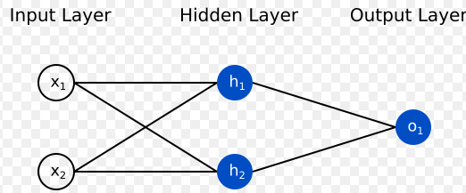
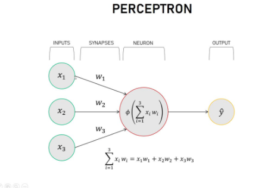

# WHAT IS CNN?

Before understanding what is CNN, Lets talk about Neural Network again, Neural Network (NN) acts as a black box brain that takes input and predicts an output 
its different and better than most traditional machine learning algorithms because it learns complex, non linear mappings to produce far more accurate output classification results.

A simple NN has a input layer, hidden layer and Output layer. 

