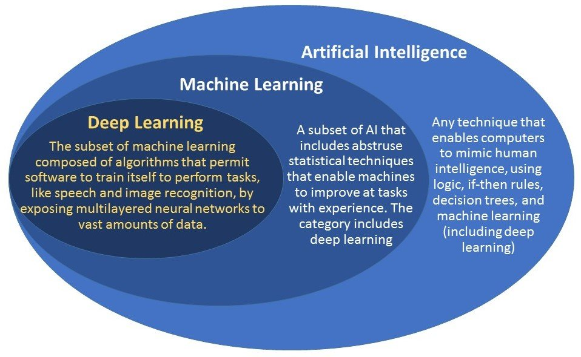

# Difference between Machine learning and Artificial Intelligence

 “It is the study of how to train the computers so that computers can do things which at present human can do better.”Therefore It is a intelligence where we want to add all the capabilities to machine that human contain.

Machine Learning : Machine Learning is the learning in which machine can learn by its own without being explicitly programmed. It is an application of AI that provide system the ability to automatically learn and improve from experience. Here we can generate a program by integrating input and output of that program. One of the simple definition of the Machine Learning is “Machine Learning is said to learn from experience E w.r.t some class of task T and a performance measure P if learners performance at the task in the class as measured by P improves with experiences.”
The key difference between AI and ML are:

# ARTIFICIAL INTELLIGENCE	MACHINE LEARNING
AI stands for Artificial intelligence, where intelligence is defined acquisition of knowledge, ability to acquire and apply knowledge.	ML stands for Machine Learning which is defined as the acquisition of knowledge or skill
The aim is to increase chance of success and not accuracy.	The aim is to increase accuracy, but it does not care about success
It work as a computer program that does smart work	It is a simple concept machine takes data and learn from data.
The goal is to simulate natural intelligence to solve complex problem	The goal is to learn from data on certain task to maximize the performance of machine on this task.
AI is decision making.	ML allows system to learn new things from data.
It leads to develop a system to mimic human to respond behave in a circumstances.	It involves in creating self learning algorithms.
AI will go for finding the optimal solution.	ML will go for only solution for that whether it is optimal or not.
AI leads to intelligence or wisdom.	ML leads to knowledge.

