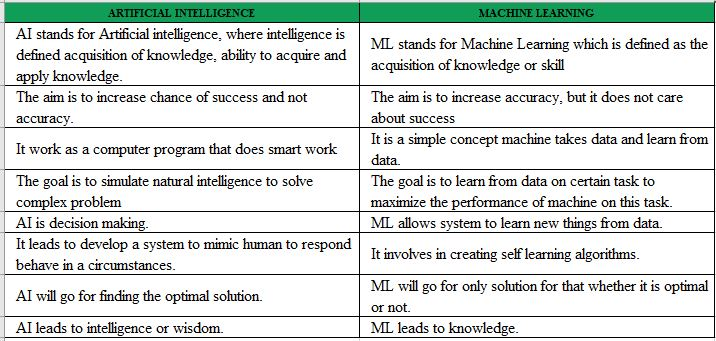
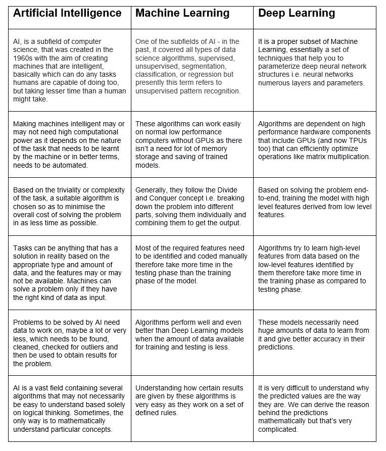

# Difference between Machine learning and Artificial Intelligence

 “It is the study of how to train the computers so that computers can do things which at present human can do better.”Therefore It is a intelligence where we want to add all the capabilities to machine that human contain.

Machine Learning : Machine Learning is the learning in which machine can learn by its own without being explicitly programmed. It is an application of AI that provide system the ability to automatically learn and improve from experience. Here we can generate a program by integrating input and output of that program. One of the simple definition of the Machine Learning is “Machine Learning is said to learn from experience E w.r.t some class of task T and a performance measure P if learners performance at the task in the class as measured by P improves with experiences.”
The key difference between AI and ML are:

